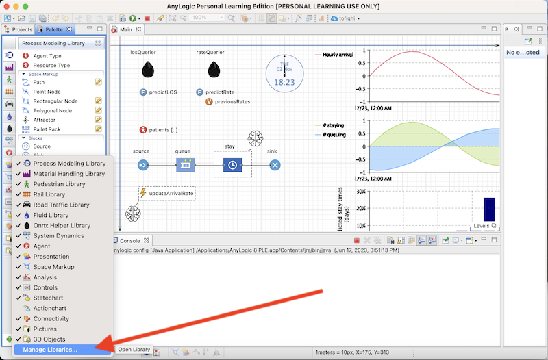

# AnyLogic
AI-based AnyLogic Application based on [this repository](https://github.com/t-wolfeadam/AnyLogic-ONNX-Helper)

### Installation

The library (a jar file) can be downloaded from the releases page, accessible on the right side of the GitHub page or from [this link](https://github.com/t-wolfeadam/AnyLogic-ONNX-Helper/releases).

After downloading, copy/move the provided jar file to a location where it won't be accidentally moved or deleted.

Then in AnyLogic, in the Palette panel, press the plus ("+") button on the bottom left corner > Manage Libraries... > Add > (Select the jar file) > (OK)

